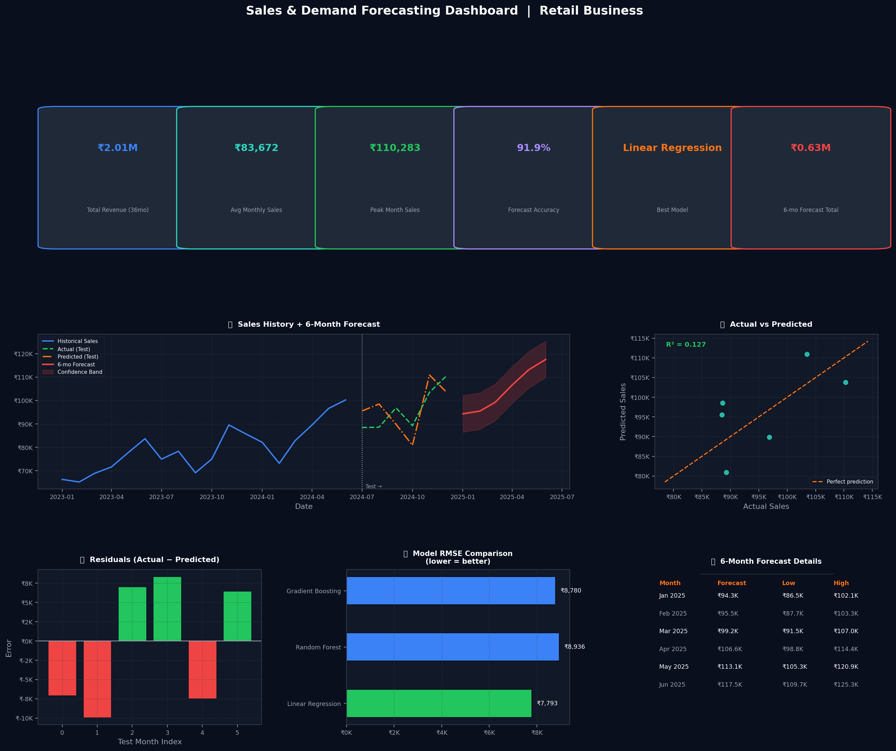

# FUTURE_ML_01-
 Sales Forecasting
# Sales & Demand Forecasting — Future Interns ML Task 1

## Overview
ML system to forecast monthly sales using 3 years of historical data.

## Features
- Data cleaning & time-based feature engineering
- 3 models: Linear Regression, Random Forest, Gradient Boosting
- 6-month future forecast with confidence band
- Business-ready dashboard with KPIs

## How to Run
pip install pandas numpy scikit-learn matplotlib
python sales_forecasting.py

## Output

## Tools Used
Python | Scikit-learn | Matplotlib | NLTK | Pandas
